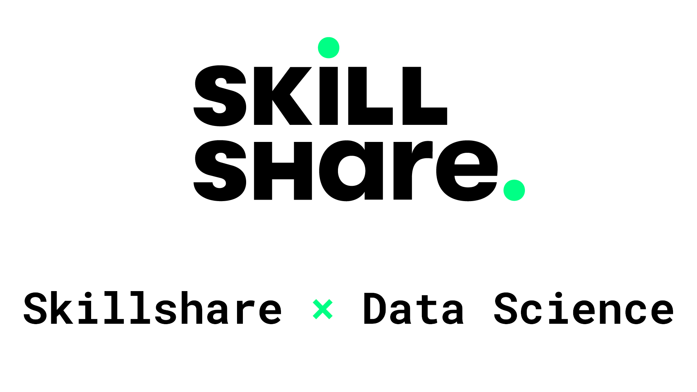

# Skillshare Data Science and Business Analytics in Python
[Skillshare - Data Science and Business Analytics with Python](https://skl.sh/2CROaFi)

2-month Free Trial of Skillshare Premium for this course and many many others

Download [all Code](https://github.com/jesperdramsch/skillshare-data-science/archive/master.zip) or [only Notebooks](https://github.com/jesperdramsch/skillshare-data-science/blob/master/notebooks.zip)

Table of Contents
---

- [Description](#description)
- [Data](#data)
- [Notebooks](#notebooks)
  1. [Data Loading](#data-loading)
  2. [Data Cleaning](#data-cleaning)
  3. [Exploratory Data Analysis](#exploratory-data-analysis)
  4. [Machine Learning](#machine-learning)
  5. [Machine Learning Validation](#machine-learning-validation)
  6. [Data Visualization](#data-visualization)
  7. [Report Generation](#report-generation)
- [Class Project](#class-project)

---
## Description

Business analytics and data science have become important skills across all industries. Knowing both how to perform analytics, as well as, sense checking analyses and understanding concepts is key in making decisions today.

Python has become the lingua franca of data science and is, therefore, the topic of this class.

Programming can be intimidating, however, Python excels due to its readability and being freely available for all platforms including Linux, Mac and Windows. This class will assume some prior knowledge of Python syntax, but to establish a common learning environment some of the basics will be covered. We will cover the full data science workflow including:

- Loading data from files (e.g. Excel tables) and databases (e.g. SQL servers)
- Data cleaning
- Exploratory data analysis
- Machine learning
- Model validation and churn analysis
- Data visualization and report generation

In this class we will  use freely and openly available Python libraries including: Jupyter, NumPy, SciPy, Pandas, MatPlotLib, Seaborn, and Scikit-Learn and you will also learn how to quickly learn new libraries.

## Data

The original data is collected in

> Pace, R. Kelley, and Ronald Barry. "Sparse spatial autoregressions." Statistics & Probability Letters 33.3 (1997): 291-297.

Modifications were made by

> Géron, Aurélien. Hands-on machine learning with Scikit-Learn, Keras, and TensorFlow: Concepts, tools, and techniques to build intelligent systems. O'Reilly Media, 2019.

made available under the CC0 license on [Kaggle](https://www.kaggle.com/camnugent/california-housing-prices), with the following modifications from the original:

- 207 values were randomly removed from the total_bedrooms column, so we can discuss what to do with missing data.

- An additional categorical attribute called ocean_proximity was added, indicating (very roughly) whether each block group is near the ocean, near the Bay area, inland or on an island. This allows discussing what to do with categorical data.

## Notebooks
Click the "notebok" badge to view or the "colab" badge to try out the notebooks interactively.

## Data Loading
### Excel Files and CSV into Pandas

 

Loading data into python from standard Excel files and comma-separated value (CSV) data.
#### Additional Resources
- [Chris Albon on Loading CSVs](https://chrisalbon.com/python/data_wrangling/pandas_dataframe_importing_csv/)
- [Shane Lynn on `Read_CSV`](https://www.shanelynn.ie/python-pandas-read_csv-load-data-from-csv-files/)
### SQL data into Pandas

 

Many companies sensibly store data in central databases. The Structured Query Language SQL gives access to these databases. We can access these databases with Python, Pandas and SQL Alchemy.
#### Additional Resources
- [Skillshare SQL course](https://www.skillshare.com/classes/SQL-Master-SQL-Database-Queries-in-Just-90-Mins/1192226128?via=jesperdramsch)
- [Kaggle Intro to SQL](https://www.kaggle.com/learn/intro-to-sql)
### Loading any file (like txt)

.ipynb) .ipynb)

Pandas works great on structured data, but sometimes data comes in weird formats. This is the general way to work with data files in Python.

### Dealing with huge datasets

 

Some data is too large for our small laptop. Some data is even too large for our terrabyte servers. Being smart about loading data can help us build better data science pipelines.
#### Additional Resources
- [Dask](https://dask.org/)
- [Making Pandas Fly](https://youtu.be/C1hqHk1SfrA?t=4551)
### Combining data sources

 

Data can come from different files and you can combine them in a single dataframe.

## Data Cleaning
### Dealing with missing values

 

#### Additional Resources
- [Towards Data Science - Imputation](https://towardsdatascience.com/pandas-tricks-for-imputing-missing-data-63da3d14c0d6)
- [Scikit-Learn Imputation](https://scikit-learn.org/stable/modules/impute.html)
### Formatting and deduping data

 

Formatting columns and removing duplicates is an important part of data preparation.
#### Additional Resources
- [Pandas Duplicated Documentation](https://pandas.pydata.org/pandas-docs/stable/reference/api/pandas.DataFrame.duplicated.html)
### Scaling and binning data

 

Data comes in all shapes and forms, but sometimes it's important to get data into the same range of values. Sometimes scaling the data is not enough, but hrouping data into similar categories is beneficial for an analysis.
#### Additional Resources
- [Scikit-Learn Scaling](https://scikit-learn.org/stable/modules/preprocessing.html)
### Advanced Strategies (Schemas)

.ipynb) .ipynb)

Validating data to be within certain ranges is an advanced strategy when automating data science processes.

### Advanced Strategies (Encoding)

.ipynb) .ipynb)

Sometimes it's good to change data from one representation to another

## Exploratory Data Analysis
### Exploratory Data Analysis

 

### Visualizing the data for EDA

 

Visualizations are an excellent start to explore data and see relationships between input features.

---

**Markdown**
#### Additional Resources
- [pyviz](https://pyviz.org/)
### Using descriptive statistics

 

Statistics describe important aspects of our data, often revealing deeper insights.

### Selecting subsets

 

Selecting subsets of data to analyze can give deeper insights.

### Finding and understanding relationships in data

 

#### Additional Resources
- [Beyond Correlation](https://github.com/ianozsvald/beyond_correlation)
## Machine Learning
### Linear regression

 

A simple machine learning model that can uncover relationships in data.
#### Additional Resources
- [Scikit-Learn Train Test Split](https://scikit-learn.org/stable/modules/generated/sklearn.model_selection.train_test_split.html)
- [Scikit-Learn Linear Regression](https://scikit-learn.org/stable/modules/generated/sklearn.linear_model.LinearRegression.html)
### Decision trees and random forests

 

Change up the machine learning models
#### Additional Resources
- [Random Forests](https://scikit-learn.org/stable/modules/generated/sklearn.ensemble.RandomForestRegressor.html)
### Machine learning classification

 

Building machine learning models to assign data to classes.

### Clustering for deeper data insights

 

Clustering exploits inherent structures in data to find relationships and memberships to groups in an unsupervised way. It can be used for data mining to generate additional insights.
#### Additional Resources
- [HDBSCAN](https://hdbscan.readthedocs.io/en/latest/)
## Machine Learning Validation
### Validating machine learning models

 

Once we built a machine learning model, we need to validate that this model learnt something meaningful from our training. This part is machine learning validation.
#### Additional Resources
- [Dummy Models](https://scikit-learn.org/stable/modules/generated/sklearn.dummy.DummyClassifier.html)
- [ML Fairness](https://en.wikipedia.org/wiki/Fairness_(machine_learning))
### Machine learning interpretability

 

In modern day machine learning it is important to be able to explain how our models "think". A simple accuracy score isn't enough. This notebook explores the lesson on interpretability.
#### Additional Resources
- [Scikit Yellowbrick](https://www.scikit-yb.org/en/latest/)
### Machine learning fairness

 

Machine Learning fairness is an important part of modern day data modeling. Here we explore an introduction to make models more fair and equitable.
#### Additional Resources
- [ML Fairness Gym](https://ai.googleblog.com/2020/02/ml-fairness-gym-tool-for-exploring-long.html)
- [F A T M L](https://www.fatml.org/)
## Data Visualization
### Basics of data visualization

 

We used data visualizations throughout this course. Here, we explore how to modify and enhance these figures.

### Visualizing geospatial data

 

Generating maps from data is a nice way to generate additional insight into data and make it instantly accessible and understandable.

## Report Generation
### Exporting Visualizations and data

 

Sometimes we want to save checkpoints from our data. That means we need to save the data in an appropriate format. The same goes for visualizations that can be used in presentations, reports, and designs.
#### Additional Resources
- [Matplotlib Savefig](https://matplotlib.org/api/_as_gen/matplotlib.pyplot.savefig.html#matplotlib.pyplot.savefig)
- [Exporting Holoviews](http://holoviews.org/user_guide/Exporting_and_Archiving.html)
### How to Save Presentations in Jupyter

 

Presentations can be an integral part of reporting and communicating results. With Reveal.js we can automatically generate presentations directly from jupyter.

### Generating PDF Reports

 

Generating reports directly from Jupyter can be done directly to PDF if LaTeX is installed. Otherwise, we can use the route of exporting HTML. Moreover, `nbconvert --execute` can be used to re-run the entire notebook for that clean and fresh look.
#### Additional Resources
- [LaTeX](https://www.latex-project.org/get/)
## Class Project

Create a PDF report of a data analysis in Python with at least one visualization.

**Assignment:** Use a dataset you have from a project you are working on. Prepare and analyze this data and create at least one meaningful visualization. The data could be sales, expenses, or your FitBit data! Make sure to anonymize the data in case anything is sensitive information! (If you don’t have any data, I have some data listed and even a data set you can use below!)

**Deliverable:** Create a Jupyter Notebook describing your analysis process that contains at least one visualization that tells a compelling story.

**Details:** The project will consist of loading data and performing the exploratory data analysis and visualizations outlined in the class. The project is relatively straight-forward, as the class will follow an applied structure that can be revisited for parts of the project analysis.

Students are encouraged to use their own datasets for the analysis, as these yield the most benefit in learning. Alternatively, it is also possible to search for data sets in the following places:

- OpenML: <https://www.openml.org/search?type=data>
- Google: <https://datasetsearch.research.google.com/>
- Amazon: <https://registry.opendata.aws/>
- Kaggle: <https://www.kaggle.com/datasets>
- Awesome Data: <https://github.com/awesomedata/awesome-public-datasets>

In addition, to encourage sharing, I will provide one example data set on Skillshare, where people can explore and apply the learnings from this class. This dataset contains California Housing Sales from the 1990 census.

Help each other! Data science thrives from collaboration. Students are encouraged to learn from each other and give feedback on tips and tricks they found during their own analysis. Use the project tab early and often and also check what others have accomplished and leave feedback and likes.

Installing all the libraries: When you have conda installed, you can easily use the environment.yml in the notebooks.zip it contains all libraries. Open it with a text editor to see the command to get the environment set up.

### [Sign Up here](https://skl.sh/2CROaFi)

